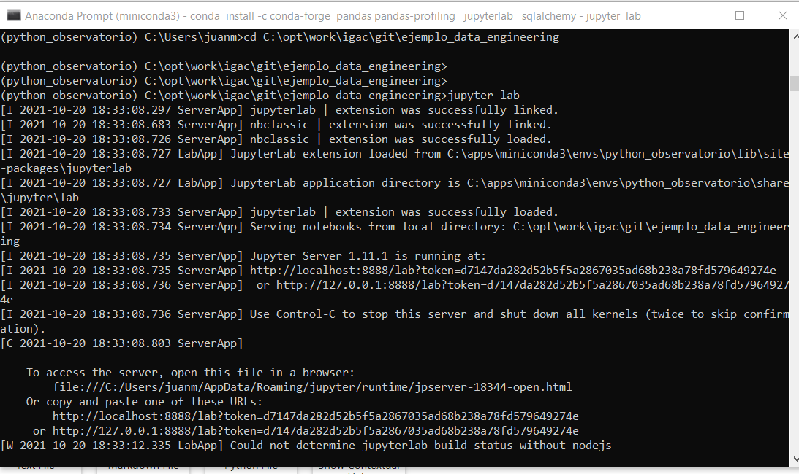
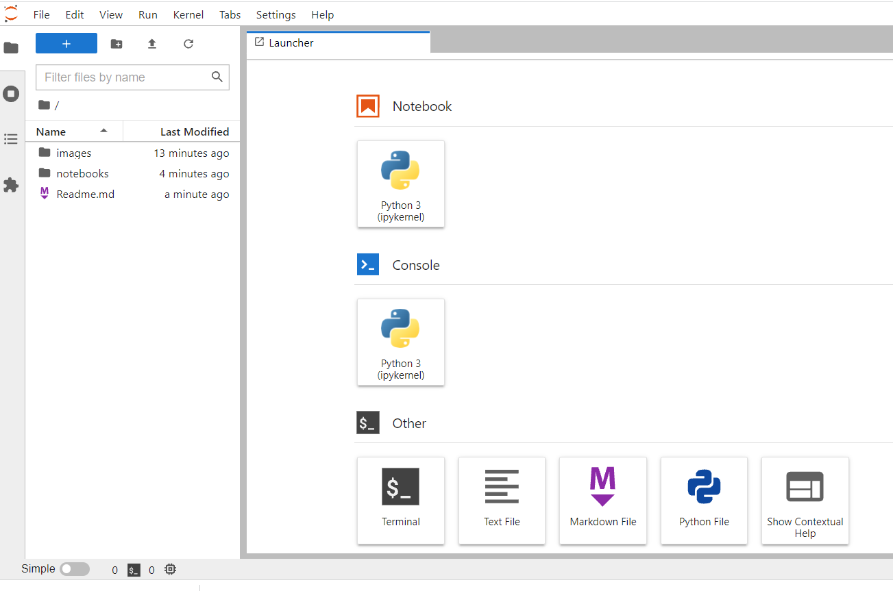

# Ejemplo Ingeniería de datos utilizando panda


## Prerrequisitos

Instalar miniconda

    https://docs.conda.io/en/latest/miniconda.html

    https://repo.anaconda.com/miniconda/Miniconda3-latest-Windows-x86_64.exe

Ejecutar la aplicación "Anaconda Prompt (miniconda3)"


Aparecerá la pantalla del prompt:


Configurar entorno 

```bash
conda env list

## creación entorno
conda create --name python_observatorio

## activación entorno
conda activate python_observatorio

## instalación de librerías 
conda install -c conda-forge  pandas pandas-profiling   jupyterlab   sqlalchemy
conda install -c conda-forge ipywidgets
conda install -c conda-forge xlrd
```

Una vez las dependencias se encuentren instaladas debe iniciar la aplicación "Jupyter lab":

```bash
## ingresar a la carpeta del proyecto
cd C:\opt\work\igac\git\ejemplo_data_engineering

## iniciar jupyter lab
jupyter lab
```

En el prompt aparecerá algo como lo siguiente:





En el navegador aparecerá el entorno de Jupyter lab




Ingrese a la carpeta notebooks y haga la exploración de los archivos que allí encuentre.

